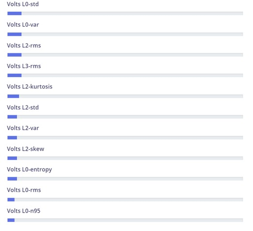

# Edge impulse 

## Laboratorio 10 - Equipo 6

## Tabla de contenido

- Introducción
- Materiales
- Métodos
- Resultados: Gráficas e imágenes   
- Discusión
- Referencias

#

### Introducción

La electromiografía (EMG) se centra en la captura, registro y evaluación de la actividad eléctrica producida en los nervios y músculos mediante el empleo de electrodos, ya sean superficiales, de aguja o implantados. Los datos obtenidos a través de la EMG ofrecen información sobre la fisiología y los modelos de activación muscular [1]. La electromiografía de superficie es una técnica no invasiva, por lo que no requiere supervisión profesional ni incomoda al paciente y es fácil de usar. Sin embargo son solo para músculos superficiales, están sujetas a alteraciones por el movimiento y no hay una colocación de electrodos protocolizada mientras que la electromiografía de aguja es invasiva, por lo que requiere profesionales de salud capacitados pero es muy sensible y tiene acceso a los músculos profundos. La electromiografía ayuda a diagnosticar o descartar enfermedades musculares, nerviosas o medulares. En el laboratorio se empleó la plataforma edge impulse que sirve para desarrollar algoritmos de aprendizaje máquina enfocados a implementarse en sistemas embebidos como microcontroladores o computadoras con recursos reducidos [2]. Se utilizó principalmente para clasificar y extraer características con la finalidad de entrenar un modelo.

#

### Materiales

| Descripción | Cantidad |
|---|---|
| Plataforma de Edge Impulse| 1 |
| Laptop | 1 | 

### Metodología

1.En el  sitio web de Edge Impulse (https://www.edgeimpulse.com/) y creamos una cuenta e iniciamos sesión.

2.Seleccionamos  "Create a new project" para crear un nuevo proyecto.

3.Configuramos el proyecto: Proporcionamos un nombre y una descripción para nuestro proyecto. Seleccionamos la categoría adecuada para el tipo de señal que se estaba trabajando.

4.En la pestaña "Data acquisition" en el panel de nuestro proyecto. Cargamos nuestros datos de la señal adquirida. 

5.Después de cargar los datos, en la pestaña "Labeling" etiquetamos nuestros datos. Se debe especificar las etiquetas correctas para cada conjunto de datos.

6.En la pestaña "Splitting," dividimos los datos en conjuntos de entrenamiento y prueba. Esto ayudó a evaluar el rendimiento del modelo.En nuestro caso fue el antes y el después de conducir.

7.En la pestaña "Impulse design" configuramos y diseñamos el modelo. Tuvimos la opción entre diferentes bloques de procesamiento y configuramos la arquitectura del modelo. 

8.Una vez diseñado el modelo, fuimos a la pestaña "NN Classifier" y seleccionamos "Start training" para entrenar el modelo con los datos proporcionados.

9.Después de que el modelo haya terminado de entrenarse, fuimos a la pestaña "Live classification" para evaluar el rendimiento con nuevos datos.

1.Finalmente, verificamos el rendimiento.

#

### Resultados

 Figura 1: Caracteristicas obtenidas

 

 Figura 2: Resultado del modelo

 

 #

### Discusión 
El modelo de aprendizaje automático  fue entrenado para clasificar dos labels. El label de antes de conducir y después de conducir. El modelo obtenido ha sido entrenado de una manera óptima, pero su rendimiento es malo al enfrentarse a nuevos datos, ya que al ingresar nueva información esté lo calificaría como el estado 0. Además, se obtuvo un total de 56 características entre ellas tenemos el rms, entropía, mediana, media, desviación estándar estándar, etc. Esto se obtuvo mediante un análisis espectral tipo Wavelet db7. Finalmente se realizó un análisis estadístico en donde se colocó los músculos evaluados y las características obtenidas.

 Link del modelo: https://studio.edgeimpulse.com/public/310594/latest 

### Referencias
[1] “Electromiografía - Mayo Clinic,” Mayoclinic.org, 2019. https://www.mayoclinic.org/es/tests-procedures/emg/about/pac-20393913 (accessed Nov. 19, 2023).
[2] 330ohms, “¿Qué es Edge Impulse?,” 330ohms, May 19, 2021. https://blog.330ohms.com/2021/05/19/que-es-edge-impulse/ (accessed Nov. 19, 2023).
