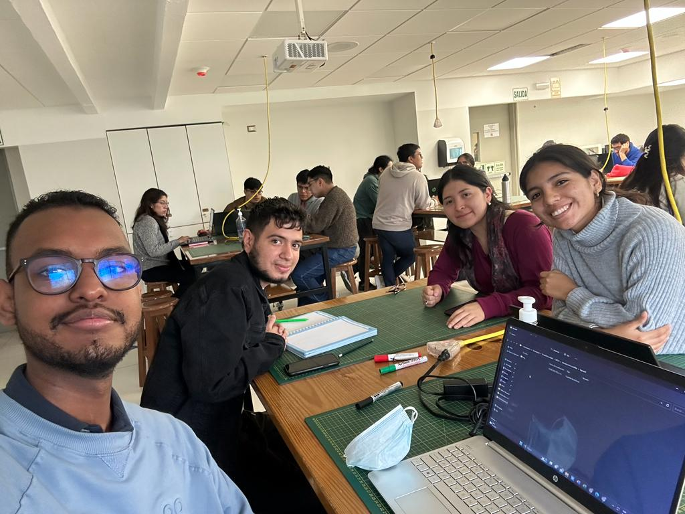

# Introducción de señales

Bienvenidos al repositorio del grupo 6.

Somos un grupo de estudiantes de ingeniería biomédica, el cual comparte una profunda pasión por la mejora de la atención médica y la calidad de vida de las personas a través de la aplicación de la tecnología. Estamos motivados por la idea de utilizar nuestros conocimientos en ingeniería para desarrollar soluciones innovadoras que puedan ayudar a diagnosticar, tratar y prevenir enfermedades de manera más efectiva.

## Integrantes 

- Lucero Gómez - 70669873: Estudiando de Ingeniería Biomédica del noveno ciclo, interesada en la rama de Ingeniera Clínica y Señales e Imágenes Biomédicas.
- Angie Nuñez - 73202687: Estudiando de Ingeniería Biomédica del noveno ciclo, interesada en la rama de Ingeniera Clínica y ingeniería de Tejidos.
- Victor Rivas - 71474515: Estudiante de ingeniería biomédica de décimo ciclo que quiere especializarse en ingeniería clínica y ingeniería de tejidos.
- Francisco Ruiz - AY853936: Estudiante de ingeniería biomédica interesado en la ciencia de datos, procesamiento de imagenes, programación backend e ingeniería clínica

