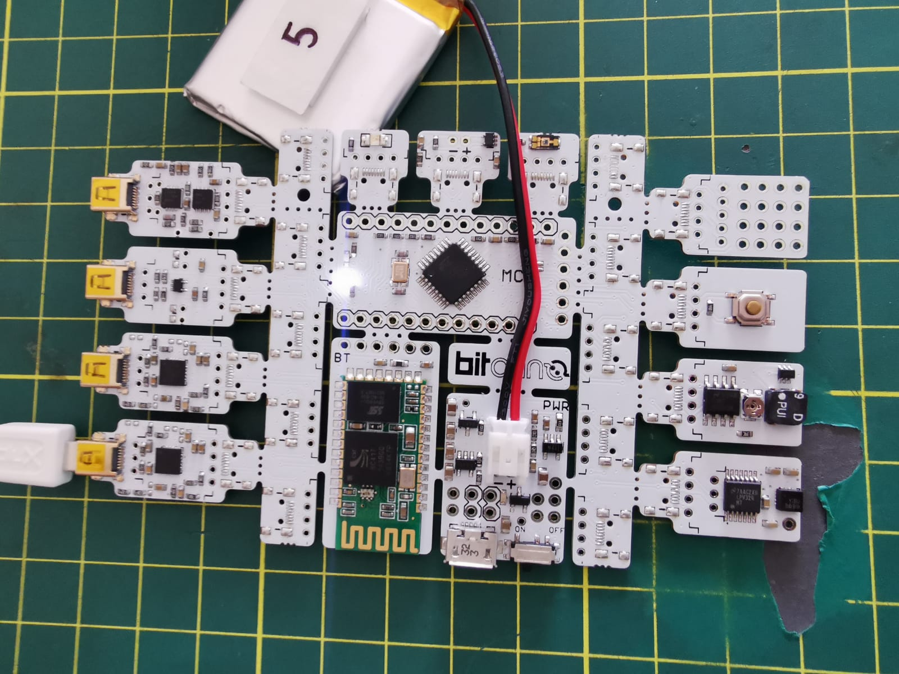
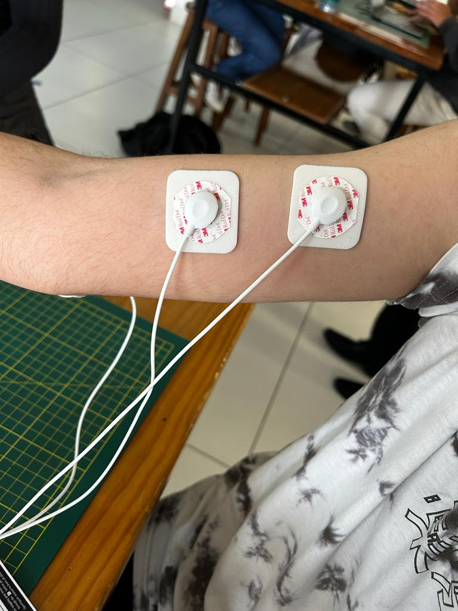
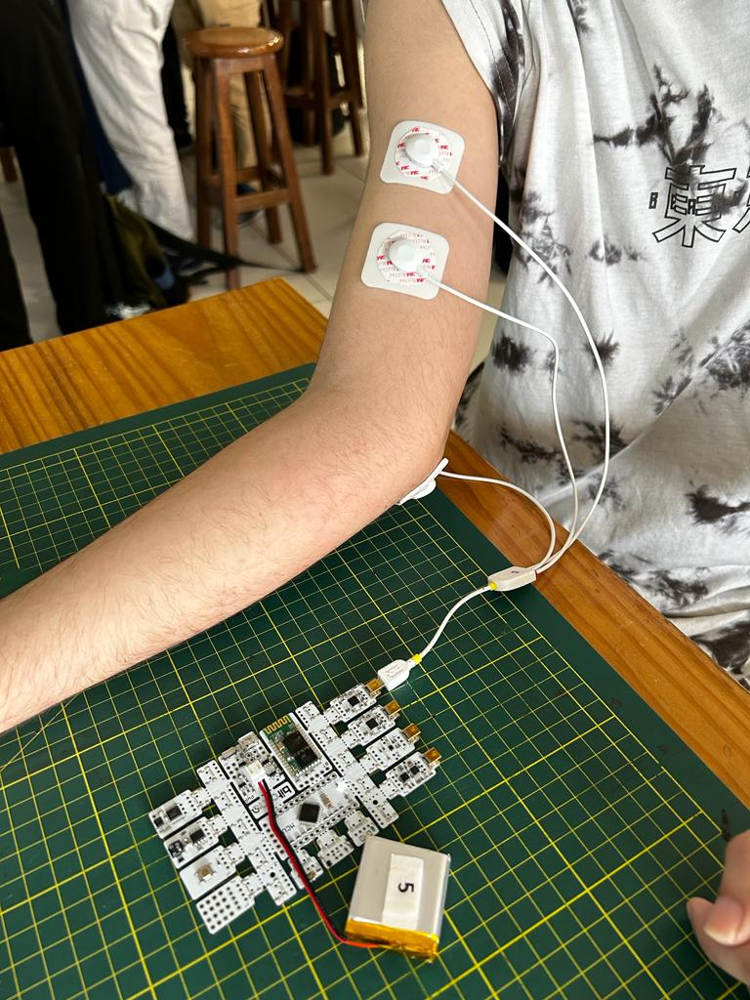
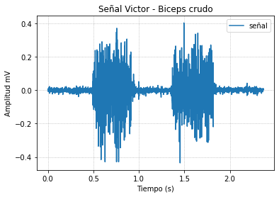
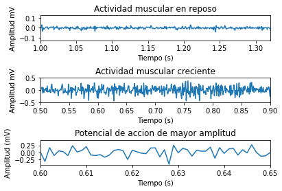
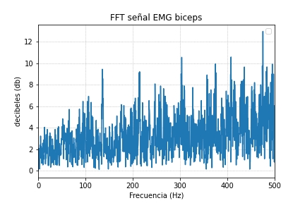

## Uso de BiTalino para obtención de EMG

Existen dos métodos principales para obtener señales de EMG: la medición desde la superficie de la piel (sEMG) o mediante agujas concéntricas que penetran la piel para medir la señal a nivel de las fibras. En este caso, solo consideramos la EMG desde la superficie de la piel, para lo cual se necesita una interfaz entre la piel y el sensor que maximice la conductividad eléctrica y minimice los artefactos mecánicos; por ello, empleamos un electrodo sEMG de grado médico.

 {height=250}

## Posicionamiento eletródos y conectividad con BITalino

| posicionamiento electródos             | Conectividad BITalino       |
| ----------------- | ------------------------------------------------------------------ |
| 
  | 

## videos de funcionamiento
### Video biceps

<iframe width="50%" height = "420"
src="Img_videos/VideoBiceps1.mp4">
</iframe>

### Video flexor

<iframe width="50%" height = "420"
src="Img_videos/VideoFlexor2.mp4">
</iframe>

## Resumen y explicación señal ploteada

En vista de que las señales de electromiografía tienen una amplitud muy baja en el nivel de milivoltios, tuvimos que amplificarlas 1000 veces para reducir el ruido y poder procesarlas mediante un ADC. También se consideró trabajar con la señal en una banda de frecuencia específica, como 20-450Hz, que aún conservara toda la información muscular relevante. 
Para recibir esta señal del músculo bíceps braquial, se ejecutó el siguiente protocolo: se emplearon electrodos nuevos, la piel se limpió antes, se verificó que los tres electrodos estuvieran completamente adheridos a la piel, se emparejó el módulo a la laptop a través de Bluetooth y los cables (sensores y referencia) estaban conectados al puerto analógico 1. 
Con todos esos pasos, las señales de EMG obtenidas del bíceps braquial se obtuvieron utilizando una configuración bipolar con dos electrodos de medición y un electrodo de referencia en una zona neutral (el codo). Esta configuración nos permitió cancelar el ruido que afectaba a los electrodos de medición y aseguró una medición precisa de la actividad muscular. Por último, la actividad eléctrica fue evaluada en dos fases: relajación y contracción, cada una de ellas tuvo una duración de 5 segundos.
Por otro lado, una segunda medición se llevó a cabo posicionando los electrodos sobre el abductor pollicis brevis, de la mano. De manera análoga, se dispuso un arreglo de dos electrodos sobre este músculo y el tercero se posicionó en el codo. Éste realizó la abducción del pulgar durante 5 segundos y luego tuvo un periodo de relajación por otros 5 segundos más. Finalmente, se obtuvo 2 periodos de esta acción que pueden ser visualizados en el ploteo.
### Archivos

* [Archivos de las señales TXT ](Img_videos/) 
* [NoteBook ploteo](Lecturaseñal1.ipynb) 
### Ploteo en Python
##### Gráfica Biceps Crudo

#### Reposo, fase activa y potencial de acción

#### FFT Señal

### Referencias

[1]	«BITalino (r)evolution Lab Guide».

