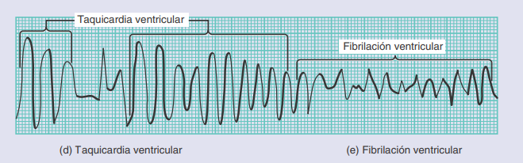
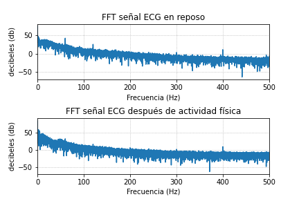

# Uso de BITalino para captura de ECG

## Laboratorio 4

#### Introducción

En Perú, las enfermedades cardiovasculares son una de las causas con mayor índice de mortalidad, ocupando el tercer puesto según cifras del INEI. Asimismo, la Organización Panamericana de la Salud (OPS), indica que aproximadamente el 16% de la población peruana mayor de 20 años padece alguna complicación cardiaca.
El electrocardiograma es una herramienta complementaria para el diagnóstico de diversas patologías, es un indicador objetivo que muestra mediante ondas e intervalos diferentes alteraciones cardiológicas de tipo eléctrico que pueden ser adicionales para el diagnóstico definitivo de distintas enfermedades. 
Puede ayudar a diagnosticar enfermedades como arritmias, miocardiopatías, angina o infarto.

En el contexto peruano, las enfermedades cardiovasculares se han convertido en una preocupación de salud pública significativa, con un impacto sustancial en la mortalidad. Según datos del Instituto Nacional de Estadística e Informática (INEI), estas enfermedades ocupan el tercer lugar en términos de índice de mortalidad en el país. Además, según la Organización Panamericana de la Salud (OPS), alrededor del 16% de la población peruana mayor de 20 años enfrenta complicaciones cardíacas en algún grado [a ]. A nivel global, en 2019, estas enfermedades cobraron la vida de 2.0 millones de personas, subrayando la magnitud del problema a nivel mundial [ ]. Para abordar este desafío y reducir la carga de enfermedades cardiovasculares en Perú, el electrocardiograma emerge como una herramienta fundamental en el diagnóstico de diversas patologías. Este procedimiento proporciona una visión objetiva de la actividad eléctrica del corazón a través de ondas e intervalos, lo que resulta esencial para el diagnóstico preciso de una amplia gama de afecciones cardíacas, incluyendo arritmias, miocardiopatías, angina e infarto [c ]. 

#### Materiales

| Descripción | Modelo | Cantidad |
|---|---|---|
| Kit BITalino | (r)evolution Assembled Core BT | 1|
| Laptop | - | 1 | 
| Electrodos desechables adhesivos gelificados | 2230 RED DOT marca 3M | 3 | 
| Software | OpenSignals | 1 |
| Crónometro | - | 1 | 
|ProSim | ProSim 4 | 1|

#### Metódos

En primer lugar, se realizó el emparejamiento entre el módulo BITalino y la laptop vía Bluetooth. Seguidamente, para obtener la derivación I de manera horizontal, se llevó a cabo la siguiente disposición bipolar de los sensores: un primer electrodo fue el terminal negativo en la región anterior de la muñeca derecha. Mientras que el terminal positivo estuvo ubicado en la posición análoga de la muñeca izquierda. Por último, se ubicó un electrodo de referencia a la altura de la cresta ilíaca izquierda. Luego, estos sensores fueron conectados al módulo a través del puerto analógico A2 mediante un cable de tres conductores de los cuales cada uno tenía un receptáculo tipo broche para la almohadilla de su electrodo [a→d]. Se contó con la participación de 2 voluntarios con aparente buen estado físico y se tomó registro de la frecuencia cardíaca de cada participante siendo 63 y 100 bpm, respectivamente. Posteriormente se visualizaron las señales ECG del primer voluntario a través del software OpenSignals y se extrajo 10 segundos de esta primera toma de datos. A continuación, el voluntario retiró los cables que lo unían al módulo con el objetivo de evaluar su rendimiento físico luego de una serie de intervalos de ejercicio de alta intensidad que involucró subir y bajar escaleras.
Realizar el acto de subir y bajar escaleras constituye un sistema de entrenamiento integral. En realidad, dedicar unos minutos cada día a esta práctica conlleva beneficios notables para mejorar la condición física en general, fortalecer la coordinación y tonificar los músculos. Las escaleras resultan eficaces siempre y cuando se realice este ejercicio durante un período de tiempo específico y con la intensidad adecuada; durante el proceso, es importante mantenerse en movimiento sin detenerse hasta alcanzar la meta establecida [b→e].
. 
Protocolo de Ejercicio de Escaleras para Evaluación de Rendimiento Físico [c→f]:

1. Cada sesión de ejercicio consistirá en tres ascensos consecutivos de un solo tramo de escaleras, que comprende 12 escalones cada uno.

2. Cada uno de los tres ascensos será seguido por un descenso. Esto se repetirá seis veces en total para completar una sesión de ejercicio.

3. Los participantes deberán seleccionar un ritmo "vigoroso" para los ascensos, de acuerdo a su propia percepción de esfuerzo. Se les indicará que suban un escalón a la vez.

4. Después de completar cada ascenso y descenso, se permitirá a los participantes caminar a su propio ritmo sobre terreno plano durante un período de 30 segundos antes de iniciar el siguiente ciclo de ascenso y descenso.

5. Los participantes recibirán instrucciones específicas para mantener un ritmo desafiante al ascender y un ritmo cómodo al descender las escaleras. Se les animará a utilizar las barandillas como apoyo si así lo desean.

6. Se registrará el valor de BPM alcanzado por cada participante al final de toda la serie de intervalos de alta intensidad (ascensos de escaleras) y de baja intensidad (descensos de escaleras).

Inmediatamente después de la culminación del ejercicio vigoroso realizado por cada participante, se tomó registró de su frecuencia cardiaca y se procedió a conectar cada cable a los electrodos que permanecieron en las muñecas y en la cresta ilíaca. Finalmente, se dio inició a la adquisición de señales que fueron visualizadas en el software mencionado y también se guardó un fragmento de 10 segundos de duración para su posterior  análisis.

#### Conexión BITalino

|Sujeto 1 | Sujeto 2 |
|---|---|
| | | 

#### Gráficas en reposo OpenSignals

|Sujeto 1 | Sujeto 2 |
|---|---|
| | | 

Aquí se pueden visualizar ciertas diferencias entre los sujetos. En el segundo se puede observar mayor ruido en la señal, mayor amplitud en la onda S y una onda T más ancha y también con mayor amplitud. En el apartado de discusión se abordarán las posibles causas de lo anteriormente descrito.

#### Gráficas comparando reposo y actividad física

|Sujeto 1 | Sujeto 2 |
|---|---|
| | | 

De acuerdo con el algoritmo creado, la frecuencia cardiaca del sujeto 1 en reposo fue de 62 lpm y, luego de realizar actividad física, fue de 118 lpm.

Por su parte, la frecuencia cardiaca del sujeto 2 en reposo fue de 83 y, luego de la actividad física fue de 149. En el sujeto 2 después de la realización de la actividad física, se aprecia que la onda T tiene mayor amplitud que el mismo complejo QRS.

#### Gráficas arrojadas por PromSim 

En la imagen anterior se observa 4 diferentes ritmos cardiacos arrojados por el dispositivo ProSim, el cual simula ECG. 

La gráfica de la sección superior izquierda corresponde a un ritmo normal de 150 lpm. El que le sigue a la derecha es un ritmo normal también pero que sus lpm corresponden a 180. Por su parte, los 2 ritmos de la sección inferior corresponden a ritmos de paro, más especificamente a taquicardia ventricular y fibrilación ventricular. 

 [g]

#### Análisis espectral de las señales

|FFT Sujeto 1 | FFT Sujeto 2 | FFT ProSim|
|---|---|---|
| | | 

Las imágenes son consistentes con la teoría, las bajas frecuencias son dominantes en la toma de ECG. Asímismo, se evidencian algunas frecuencias que podrían corresponder a artefactos o ruidos, tales como la que corresponde a 60 Hz (de la fuente de alimentación), 2.4 Hz (interferencia electromagnética por dispositivos móviles que utilicen WiFi o Bluetooth). Las frecuencias más altas podrían estar relacionas con actividad muscular superficial (EMG).
#### Videos de la actividad Física

#### Videos de la toma del ECG

#### Videos ProSim

### Discusión

•	Para la toma de datos con el BITalino se debe establecer un protocolo cuando la toma de datos sea con actividad física y sin, para poder obtener datos que se puedan analizar.

•	Se identifica que la onda S se destaca más en la segunda toma del sujeto 2, lo cual resalta la importancia de comprender cómo ciertos factores, como la ubicación incorrecta de los electrodos o una conexión deficiente entre los electrodos y la piel, pueden resultar en una apariencia inusual en el registro del BITalino. La ubicación de los electrodos en el cuerpo puede impactar en la amplitud de las ondas en el ECG, especialmente si se orientan de manera que registren el flujo de corriente eléctrica en una dirección específica. Además, se debe considerar cómo la anatomía del corazón, las condiciones cardíacas, la edad y el género pueden influir en las mediciones obtenidas, pero no se puede llegar a un diagnóstico con la toma del BITalino. Si se analiza el tema fisiológico, se debe considerar que la onda S es más prominente en un electrocardiograma (ECG) cuando hay una hipertrofia ventricular izquierda (HVI) o un bloqueo de rama derecha (BRD). Estas condiciones hacen que la despolarización del ventrículo izquierdo se retrase y se prolongue, lo que produce una onda S más profunda y ancha en las derivaciones precordiales derechas (V1-V2) y en las derivaciones periféricas izquierdas (I, aVL) [H][I]. En resumen, en este caso no se puede llegar a una conclusión definitiva, ya que mientras un ECG tradicional se especializa en la medición precisa de señales cardíacas, el BITalino es una plataforma más versátil que puede capturar señales cardíacas, aunque su enfoque principal es brindar flexibilidad para diversas aplicaciones de adquisición de señales fisiológicas.

Recomendaciones: 

•	Respecto a la toma de datos con el BITalino se debe considerar la idoneidad de la tecnología para el propósito específico. Si la precisión es de suma importancia, como en el diagnóstico de afecciones cardíacas críticas, un ECG tradicional podría ser la mejor opción. Sin embargo, si se necesita flexibilidad en la adquisición de señales para aplicaciones más diversas, BITalino puede ser adecuado.

•	Se debe verificar bien la ubicación de electrodos, además que cuando se haga la toma no haya interferencias ya que la señal se puede alterar. 

•	Si bien el BITalino aplica filtros específicos para cada una de las señales, se debe filtrar aún más la señal para obtener mejores resultados. Se podrían aplicar algunas técnicas de filtros digitales como FIR e IIR. 

#### Referencias

[a]
Clínica Anglo Americana, “Enfermedades Cardiovasculares: la tercera causa de muerte en el país - Clínica Anglo Americana,” Clínica Anglo Americana, Mar. 12, 2021. https://clinicaangloamericana.pe/enfermedades-cardiovasculares-la-tercera-causa-de-muerte-en-el-pais/#:~:text=En%20Per%C3%BA%2C%20las%20enfermedades%20cardiovasculares,a%C3%B1os%20padece%20alguna%20complicaci%C3%B3n%20cardiaca. (accessed Sep. 17, 2023).

‌[b]
“La Carga de Enfermedades Cardiovasculares - OPS/OMS | Organización Panamericana de la Salud,” Paho.org, 2018. https://www.paho.org/es/enlace/carga-enfermedades-cardiovasculares#:~:text=En%202019%2C%202.0%20millones%20de,000%20habitantes%20en%20el%202019. (accessed Sep. 17, 2023).
‌
[c]
S. Trejo, “Revisión bibliográfica : Interpretación del electrocardiograma, una herramienta para la detección de cardiopatías,” Xoc.uam.mx, 2021, doi: https://repositorio.xoc.uam.mx/jspui/handle/123456789/26548.

[d]
BITalino (r)evolution Board Kit - DEV-14022 - SparkFun Electronics [Internet]. Sparkfun.com. 2023 [cited 2023 Sep 17]. Available from: https://www.sparkfun.com/products/retired/14022

[e]
López Núñez, Álvaro, Monroy M, Molinares C. EFECTOS DEL USO DE ESCALERAS EN LA SALUD FÍSICA. Biosalud [Internet]. 2014 [cited 2023 Sep 17];13(2):36–47. Available from: http://www.scielo.org.co/scielo.php?pid=S1657-95502014000200004&script=sci_arttext

[f]
Valentino SE, Dunford EC, Dubberley J, Lonn E, Gibala MJ, Phillips SM, et al. Cardiovascular responses to high‐intensity stair climbing in individuals with coronary artery disease. Physiological Reports [Internet]. 2022 May 1 [cited 2023 Sep 17];10(10). Available from: https://physoc.onlinelibrary.wiley.com/doi/full/10.14814/phy2.15308

[g]
Bryan Derrickson Gerard J. Tortora, Principios de Anatomía y Fisiología. Ed. Medica Panam., 2018.

[H]
Universidad Autónoma de México. FUNDAMENTOS ELECTROFISIOLÓGICOS DEL ELECTROCARDIOGRAMA. Unidad temática II.

[I]
Biopac Student Lab. Lección 6. ELECTROCARDIOGRAFÍA (ECG) II. 

