# Uso de BITalino y Ultracortex para captura de EEG

## Laboratorio 5 - Equipo 6

## Tabla de contenido

- Introducción
- Materiales
- Métodos
- Resultados: Gráficas, imágenes y videos
- Discusión
- Referencias

#

### Introducción

La Electroencefalografía (EEG) posibilita la captura de señales originadas en el cerebro al registrar la actividad eléctrica de este órgano durante un lapso temporal. Estas señales se originan debido a la actividad eléctrica producida por miles de neuronas y se registran mediante múltiples electrodos, cuya ubicación en el paciente puede variar en cuanto a su invasividad [1]. Es utilizado para el diagnóstico de trastornos cerebrales, con un mayor enfoque en la epilepsia y otros trastornos convulsivos. Sin embargo, su versatilidad va más allá de estos trastornos específicos y se extiende a una amplia gama de aplicaciones médicas. Un electroencefalograma también puede ser sumamente útil en la identificación o tratamiento de condiciones como tumores cerebrales, lesiones cerebrales debidas a traumatismos craneoencefálicos, disfunciones cerebrales de origen diverso, trastornos del sueño, inflamación cerebral como la encefalitis herpética, accidentes cerebrovasculares y la enfermedad de Creutzfeldt-Jakob, así como otros trastornos relacionados con el sueño [2].
La proporción de la población general con epilepsia activa en un momento dado se estima entre 4 y 10 personas cada 1000. Según las estimaciones, en todo el mundo se diagnostican anualmente unos cinco millones de casos de epilepsia. En los países de ingresos altos, se estima que 49 de cada 100 000 personas son diagnosticadas de epilepsia cada año. En los países de ingresos bajos y medianos, la cifra puede ser de hasta 139 cada 100 000 personas [3].

### Materiales

| Descripción | Modelo | Cantidad |
|---|---|---|
| Kit BITalino | (r)evolution Assembled Core BT | 1|
| Laptop | - | 1 | 
| Electrodos desechables adhesivos gelificados | 2230 RED DOT marca 3M | 3 | 
| Software 1 | OpenSignals | 1 |
| Software 2 | OpenBCI | 1 | 
| Headset | Ultracortex Mark IV | 1|

### Metódos

En primer lugar, se realizó el emparejamiento entre el módulo BITalino y la laptop vía Bluetooth. Luego, se preparó la piel adecuadamente antes de pegar los electrodos en ella. Para medir la actividad cerebral desde el cuero cabelludo, se empleó la técnica de configuración bipolar que consistía en dos electrodos de medición (IN + e IN-). Asimismo, fue necesario conectar un electrodo de referencia adicional y colocarlo en una zona ósea.

| Referencia de posicionamiento de eléctrodos BITalino | Colocación electrodos en sujeto de prueba vista frontal | Colocación electrodos en sujeto de prueba vista lateral |
|---|---|---|
| 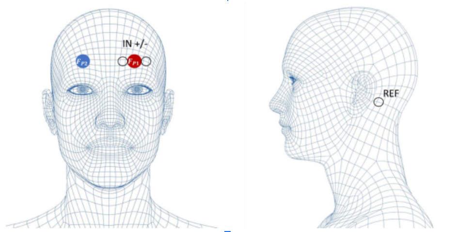 
 Figura 1: posicionamiento electrodos [4].
 | 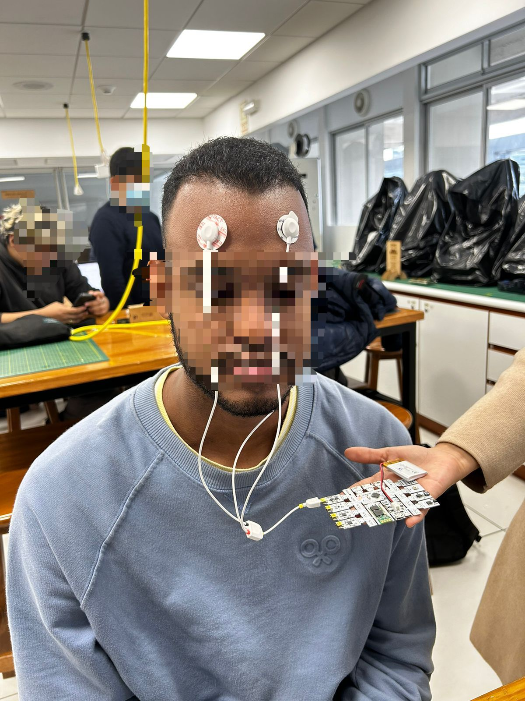|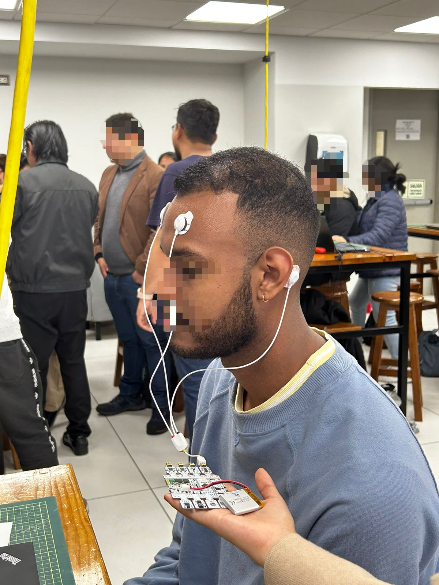|

Una vez iniciada la adquisición de señales a través del software OpenSignals, el sujeto de prueba debía suprimir cualquier activación muscular, especialmente en el área facial (movimientos oculares y parpadeos) y los movimientos del cuello y la mandíbula (apretar/masticar) [4]. Seguidamente se realizaron las siguientes preguntas a modo ejercicio mental:

 Tabla 1: Ejemplos de problemas planteados de lógica y matemáticas utilizados en el estudio [5].

 

Posteriormente, se empleó el headset Ultracortex para la obtención de las señales EEG. Para esto, se desajustaron los electrodos y se fijaron las ubicaciones de los nodos Ultracortex sobre el cuero cabelludo basado en el sistema 10-20, que es el estándar aceptado internacionalmente para la colocación de electrodos. Después, se atornillaron los electrodos de manera que el headset quedase inamovible. Seguidamente, se presionó el botón de encendido que estaba ubicado en la placa Cyton del dispositivo, se estableció el emparejamiento a través del software OpenBCI y se dio lugar a la adquisición de señales cuya visualización fue posible mediante la interfaz gráfica de usuario [6]. De manera análoga, se llevó a cabo el mismo ejercicio mental anteriormente mencionado.  
#### Ultracórtex
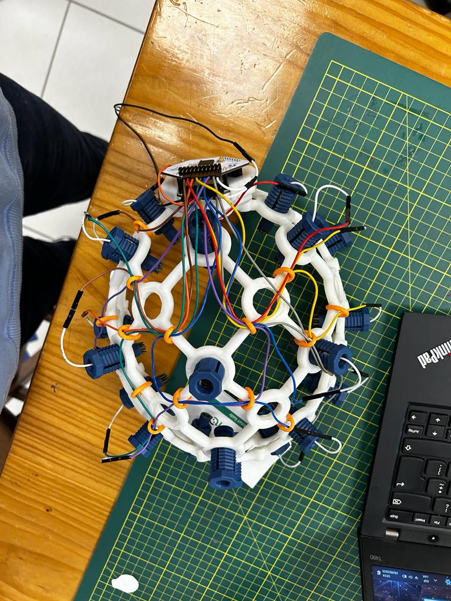

 Figura 2: Ultracórtex Mark IV 

 

#### Conexión Ultracórtex

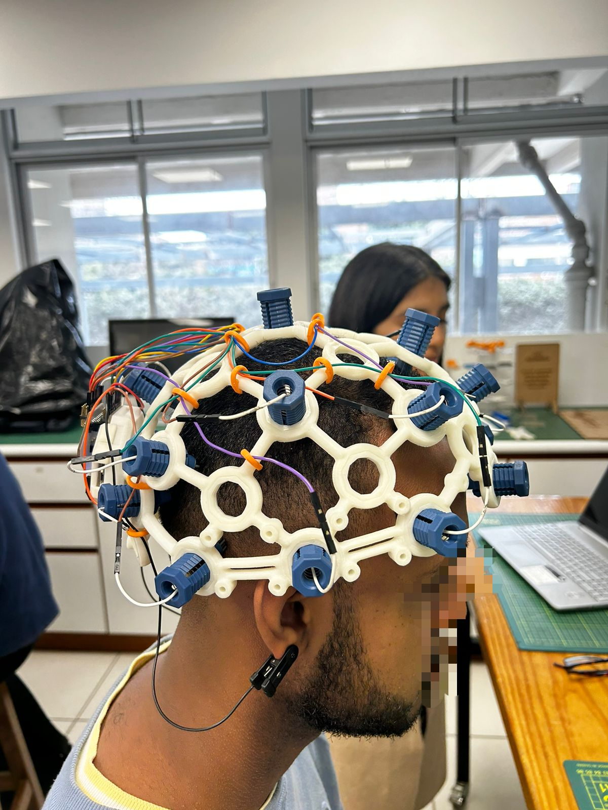

 Figura 3: Posicionamiento Ultracórtex Mark IV 

 

### Resultados: Gráficas, imágenes y videos

#### Gráficas comparación de ondas cerebrales

| Ondas cerebrales en reposo | Ondas cerebrales después de actividad mental  |
|---|---|
| 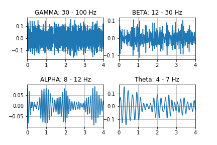|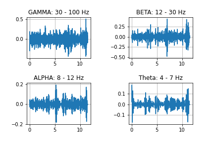 | 
| 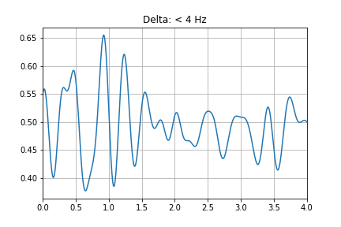|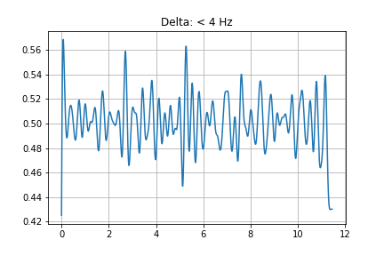 |

- Se visualiza una mayot amplitud de ondas Gamma y beta cuando se somete al cebrero a una mayor actividad mental. Esto coincide con lo descrito en la literatura, donde las ondas gamma se relacionan con el aprendizaje, el procesamiento cognitivo, tareas de resolución de problemas, agudeza mental y actividad mental; mientras que las ondas beta están relacionadas con el acto de pensar, enfocarse, la atención sostenida y el estado de alerta.

- Para las ondas Alfa y Delta, se visualiza mayor amplitud en reposo, pero mayor frecuencia en actividad mental. un Alfa con mayor frecuencia pues estar relacioado con la optimización del rendimiento cognitivo; por su parte las ondas Delta, en este caso en específico, tiene que ver con la resolución de problemas complejos; aunque en copndiciones normales está relacionado con el sueño,la reparación y la profunda inconsciencia.

- Para la onda Theta se logra percibir una amplitud similar en ambas, pero mayor frecuencia en actividad mental. Las ondas theta están relacionadas con la creatividad, la percepción; lo cual coincidiría con el ejercicio realizado; sin embargo, también tiene que ver con la depresión, ansiedad y distracción.

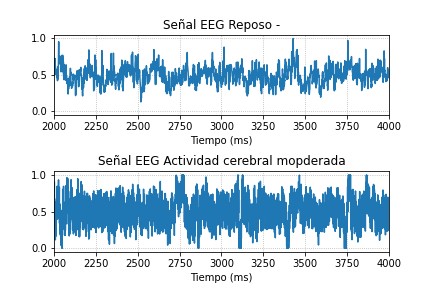

 Figura 4: Comparación de la actividad cerebral obtenida por BITalino  

 

#### Análisis espectral de las señales

|FFT BITalino | FFT Ultracórtex | 
|---|---|
| 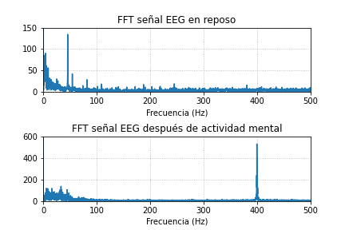|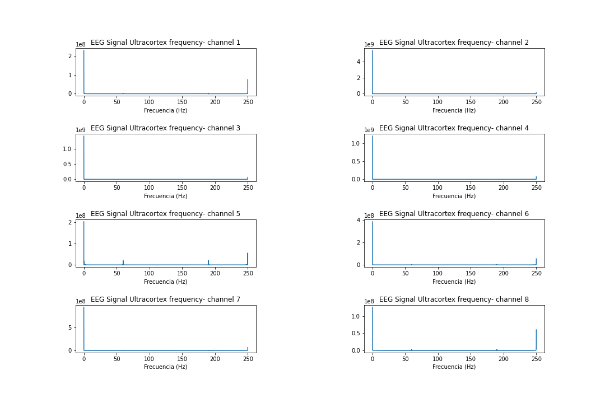 | 

- En la compáración del análisis espectral de la señal de EEG entre el reposo y la actividad cerebral intensa, se percibe una frecuen al rededor de 400 Hz.
### Videos de la toma del EEG

##### EEG BITalino Reposo

##### EEG BITalino - actividad mental

#### EEG Ultracórtex

### Discusión

- Respecto a la señal Delta en reposo podemos observar que cuenta con una amplitud más grande y una frecuencia más pequeña respecto a la señal delta después del ejercicio mental. Esta observación de una amplitud más grande y una frecuencia más pequeña en las ondas delta después del ejercicio mental sugiere que el cerebro está experimentando cambios en su actividad eléctrica en respuesta a la tarea cognitiva realizada.[7,8] Estos cambios pueden estar relacionados con la activación, la sincronización neuronal, la fatiga o el estado de relajación posterior al ejercicio mental.

- La señal Gamma tiene mayor actividad, mayor amplitud y mayor frecuencia en reposo respecto a la señal obtenida después del ejercicio mental. Este cambio refleja la dinámica de la actividad cerebral en respuesta a la tarea cognitiva realizada. Esta diferencia puede estar relacionada con la modulación de redes neuronales, la sincronización neuronal, la intensidad de la tarea, la fatiga cerebral y los cambios en el estado de alerta, entre otros factores.[8]

- La señal Alpha y Beta tienen mayor amplitud durante el reposo; mientras que después del ejercicio mental tienen menos amplitud.Esto puede estar relacionado con cambios en la atención, la sincronización neuronal, la inhibición cortical, la activación de otras frecuencias y la fatiga cerebral.[8]

- La señal Theta en ambas pruebas son parecidas. 
Las señales EEG son muy sensibles y pueden ser afectadas por la interferencia electromagnética, como la generada por otros dispositivos electrónicos cercanos. Esto podría provocar ruido en las señales EEG y afectar la calidad de los datos recopilados.

#

### Referencias

[1] “SEÑALES DE ENCEFALOGRAMA: Análisis y distinción de Canales Focales y No Focales.” Available: https://openaccess.uoc.edu/bitstream/10609/98326/6/atestapeTFM0619memoria.pdf

[2] “Electroencefalografía (EEG) - Mayo Clinic,” Mayoclinic.org, 2022. https://www.mayoclinic.org/es/tests-procedures/eeg/about/pac-20393875 (accessed Sep. 30, 2023).

[3] World, “Epilepsia,” Who.int, Feb. 09, 2023. https://www.who.int/es/news-room/fact-sheets/detail/epilepsy#:~:text=La%20proporci%C3%B3n%20de%20la%20poblaci%C3%B3n,millones%20de%20casos%20de%20epilepsia. (accessed Sep. 30, 2023).

[4] BITalino (r)evolution Lab Guide [Internet]. Available from: https://support.pluxbiosignals.com/wp-content/uploads/2022/04/HomeGuide3_EEG.pdf

[5] Río del, Miguel Ángel Guevara, Marisela Hernández González, María R, Manuel Aguilar Villagrán. EEG correlation during the solving of simple and complex logical–mathematical problems. Cognitive, Affective, & Behavioral Neuroscience [Internet]. 2019 Feb 21 [cited 2023 Oct 1];19(4):1036–46. Available from: https://link.springer.com/article/10.3758/s13415-019-00703-5/tables/1

[6] Ultracortex Mark IV | OpenBCI Documentation [Internet]. Openbci.com. 2022 [cited 2023 Oct 1]. Available from: https://docs.openbci.com/AddOns/Headwear/MarkIV/

[7] Carlos Ernesto Peña Goyas, Mauro Santoyo Mora, José Alfredo Padilla Medina.Metodología para el estudio de señales sinápticas mediante un sistema de EEG portátil.Vol. 42, Núm. 137 (2020). [cited 2023 Oct 1].Available: https://pistaseducativas.celaya.tecnm.mx/index.php/pistas/issue/view/74

[8]Chetan S. Nayak; Arayamparambil C. Anilkumar.EEG Normal.2023. [cited 2023 Oct 1].Available: https://www.ncbi.nlm.nih.gov/books/NBK539805/

