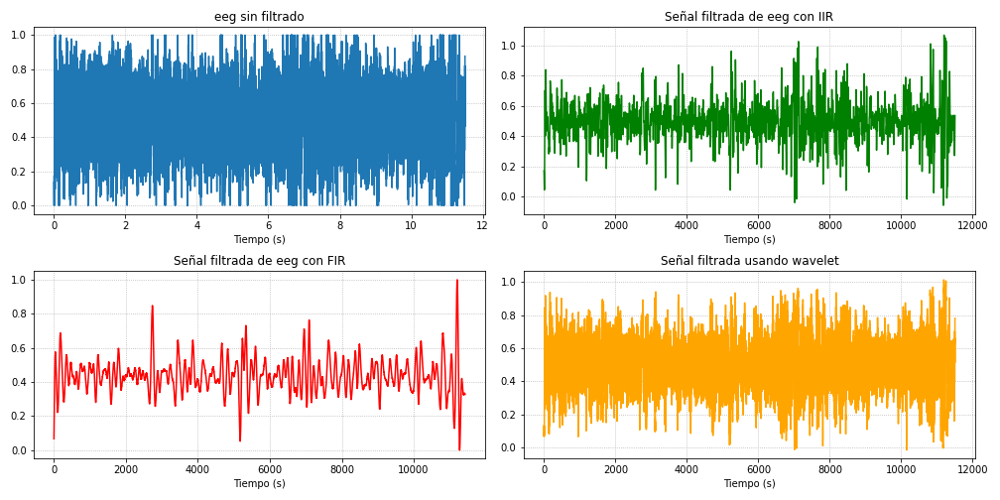
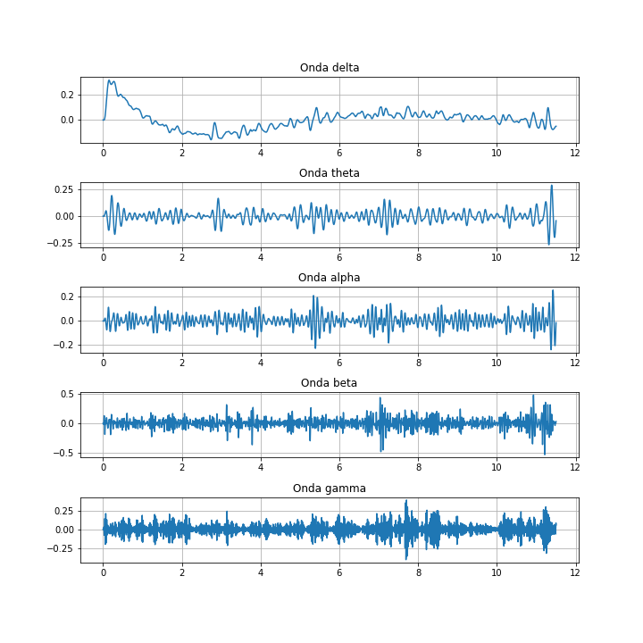
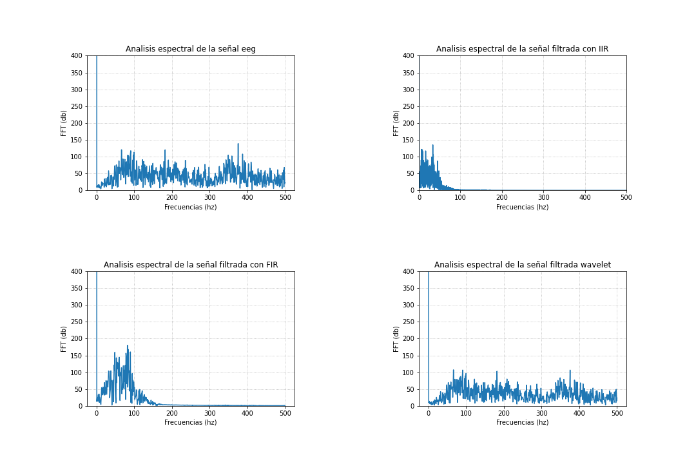
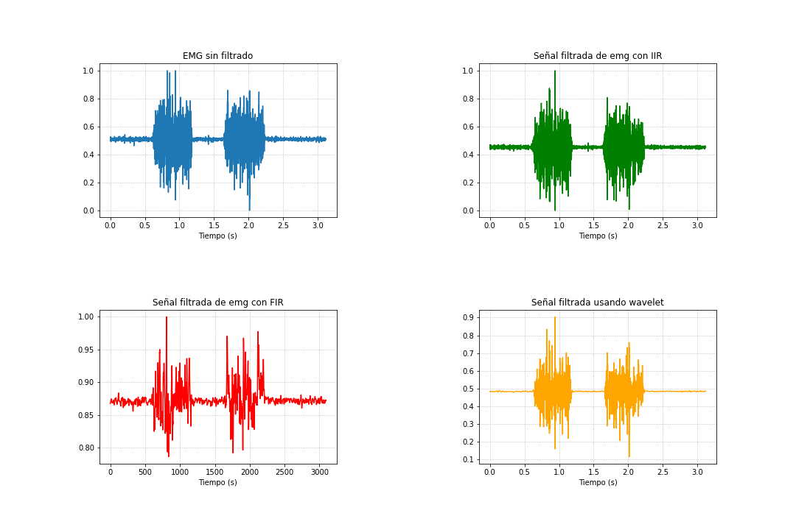
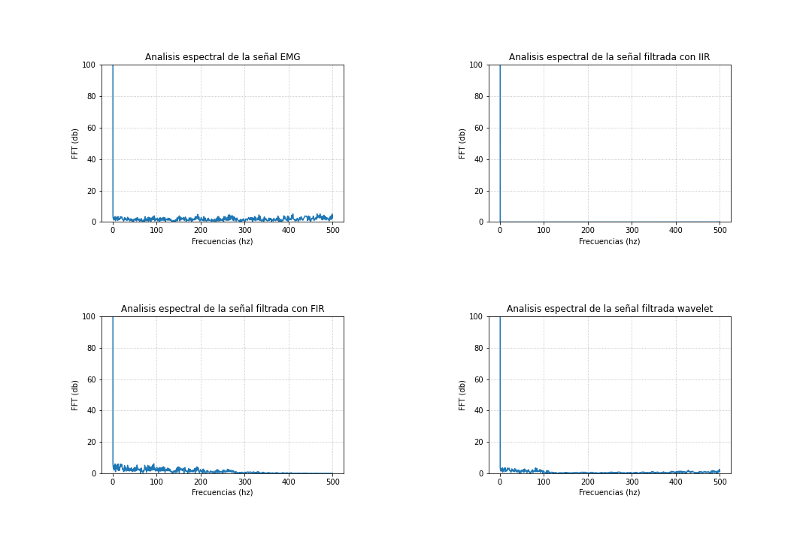
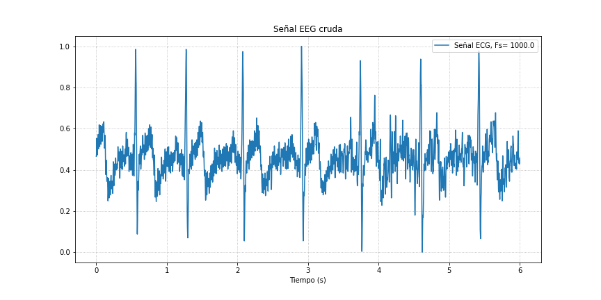
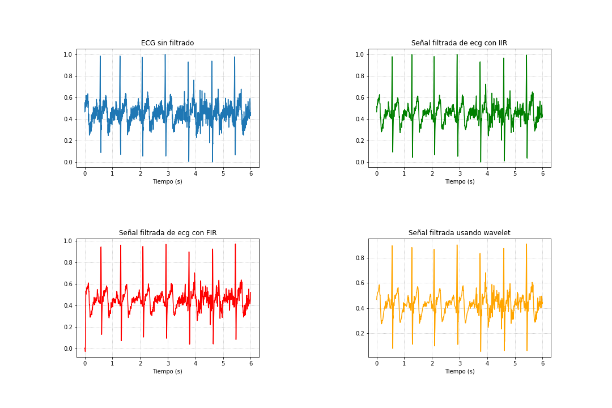
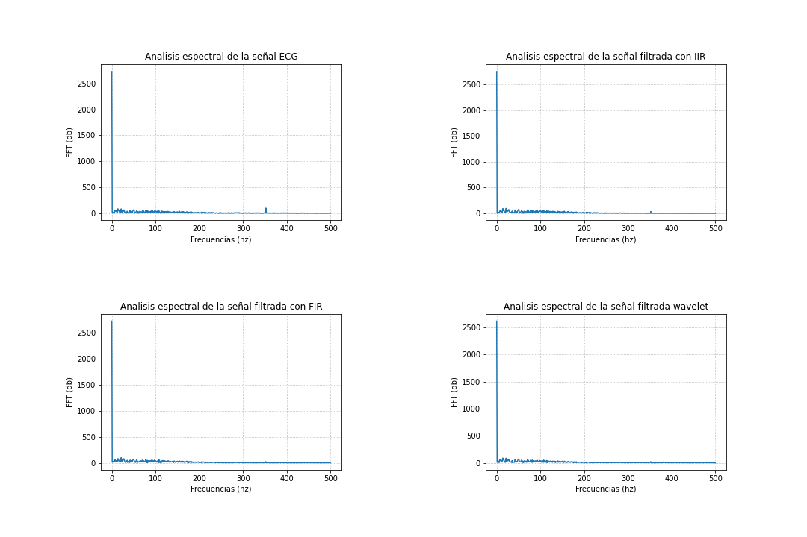

# Filtrado señales

## Laboratorio 6 - Equipo 6

## Tabla de contenido

- Introducción
- Materiales
- Métodos
- Resultados: Gráficas, imágenes y videos
- Discusión
- Referencias

#

### Introducción

Los filtros digitales son esenciales en el procesamiento de señales, ya que discriminan señales de manera virtual, ofrecen alta precisión y facilidad de diseño. En este laboratorio utilizaremos filtros FIR, IIR y Wavelet. Los filtros FIR (Respuesta finita al impulso) se caracterizan por tener una respuesta a una señal de impulso con un número limitado de términos no nulos. Sus ventajas incluyen la factible implementación utilizando la FFT, eficiencia en formas recursivas y no recursivas, estabilidad constante, y facilidad de diseño para filtros de fase lineal [1]. Los filtros IIR (Respuesta Infinita al Impulso) se caracterizan por tener una respuesta infinita al impulso y presentan retroalimentación de la señal de salida. Esto los hace ser recursivos, por lo que  su salida depende de la entrada actual, de las precedentes, sino también de las salidas anteriores, lo cual  implica una respuesta impulsional infinita en general [2]. Finalmente la transformada wavelet son señales con duración limitada y un valor promedio de cero. Estas están caracterizadas por su irregularidad y asimetría, lo que las hace más adecuadas para el análisis de señales en comparación con la transformada de Fourier. Al momento de utilizar estos principios en filtrado de señales se emplea la transformada wavelet discreta porque nos permite reconstruir la señal una vez que calculamos los coeficientes wavelet
 [3].

### Materiales

| Descripción | Modelo | Cantidad |
|---|---|---|
| Kit BITalino | (r)evolution Assembled Core BT | 1|
| Laptop | - | 1 | 
| Electrodos desechables adhesivos gelificados | 2230 RED DOT marca 3M | 3 | 
| Software 1 | Visual Studio Code | 1 |
| Software 2 | PyFDAx | 1 | 

### Metódos

El objetivo de esta metodología es filtrar las frecuencias altas de las señales de ECG, eliminando el ruido no deseado. Para lograr esto, se diseñarán dos tipos de filtros: uno IIR (Infinite Impulse Response) y otro FIR (Finite Impulse Response) [x], utilizando diferentes métodos y características específicas. El procedimiento ejecutado para el contraste de señales filtradas fue el siguiente:

1. Adquisición de datos:
   - Se utilizó el dataset de ECG generado en el laboratorio anterior como fuente de datos.

2. Selección de filtros:
   - Diseño un filtro IIR: Se seleccionó el tipo de filtro Butterworth porque es el que mejor se adapta a los requisitos de filtrado de estas señales [x].

   - Diseño un filtro FIR: Se seleccionó la ventana Hamming por su tipo de atenuación en la banda de transición y para preservar un bajo costo computacional [y].

3. Especificaciones del filtro:
     - Frecuencia de corte (Fc): 20 Hz.
     - Ancho de banda de paso (Wp): 94 rad/s.
     - Ancho de banda de rechazo (Ws): 157 rad/s.

4. Diseño de filtros:
   - Se utilizó la herramienta PyFDAx para la creación de los filtros IIR y FIR. 

5. Evaluación y optimización:
   - Se evaluó el rendimiento de los filtros en la eliminación de las frecuencias no deseadas.

   - Se realizaron ajustes para optimizar el rendimiento de los filtros, asegurando que se hubieran eliminado, eficazmente, las frecuencias altas no deseadas mientras se conservaba la información relevante de las señales de ECG.

6. Implementación y validación:
   - Se implementaron los filtros diseñados en el procesamiento de las señales de ECG.
   
#### Obtención de la señal

En primer lugar, se realizó el emparejamiento entre el módulo BITalino y la laptop vía Bluetooth. Luego, se preparó la piel adecuadamente antes de pegar los electrodos en ella. Para medir la actividad cerebral desde el cuero cabelludo, se empleó la técnica de configuración bipolar que consistía en dos electrodos de medición (IN + e IN-). Asimismo, fue necesario conectar un electrodo de referencia adicional y colocarlo en una zona ósea.

| Referencia de posicionamiento de eléctrodos BITalino | Colocación electrodos en sujeto de prueba vista frontal | Colocación electrodos en sujeto de prueba vista lateral |
|---|---|---|
|  
 Figura 1: posicionamiento electrodos [4].
 | 
 Figura : Vista frontal 
| 
 Figura 3: Vista lateral
|

Una vez iniciada la adquisición de señales a través del software OpenSignals, el sujeto de prueba debía suprimir cualquier activación muscular, especialmente en el área facial (movimientos oculares y parpadeos) y los movimientos del cuello y la mandíbula (apretar/masticar) [4]. Seguidamente se realizaron las siguientes preguntas a modo ejercicio mental:

 Tabla 1: Ejemplos de problemas planteados de lógica y matemáticas utilizados en el estudio [5].

 

### Resultados

#### Señal EEG
Se presentan a continuación, los resultados obtenidos con la señal EEG.

 Figura 4: Señal EEG cruda

 

Se presenta la señal de EEG sin la realización del preprocesamiento, en donde se representa la actividad eléctrica del cerebro durante un esfuerzo mental considerable (ver tabla 1).

La señal EEG se ha preprocesado mediante una función que aplica un filtro pasabaja de 50Hz. Lo anterior teniendo en cuenta el desarrollo de laboratorios anteriores, en los cuales se desarrollan a profundidad los conceptos técnicos del EEG. 

##### Filtrado de señal EEG

 Figura 5: Comparación de los resultados de los filtros aplicados

 
Para el diseño de tanto el filtro IIR como el FIR, se utilizaron filtros pasabajas con frecuencia de corte de 50 Hz.

Para el filtro IIR, el orden para el filtro fue de 3. Se utilizó ese orden de acuerdo con la revista medium [6].

Con respecto al filtro FIR, se utilizó la ventana hamming, con un orden de 127. Lo anterior de acuerdo con la teoría de diseño de filtros, donde para conocer el orden de un filtro pasabajas con una ventana hamming, se utiliza la ecuación M = 8/dw, donde dw es igual a la diferencia entre la frecuencia más baja y más de la banda de transición [7].

El diseño de wavelet se realizó con una wavelet madre db4 de 10 niveles por recomemdación del profesor encargado.

 Figura 6: Filtrado de las diferentes ondas

 

Se aplicó un filtro IRR para el filtrado de las diferentes ondas cerebrales.Se visualiza mayor actividad de las ondas beta y gamma, lo cual tiene coherencia con la actividad mental que estaba realizando el sujeto a la hora de la adquisición de la señal.

##### respuesta en frecuencia

 Figura 7: Respuesta en frecuencia de la señal cruda y con cada técnica de filtrado

 
Se Visualiza en la figura que tanto los filtros FIR e IRR logran cortar las frecuencias bajas. Por su parte, el filtrado del wavelet solo logra suavizar o atenuar un poco el rudio. Para mayor eficiencia de esta última, se debería inestigar más acerca de los niveles de la wavelet o inclusive la misma wavelet madre.

#### Señal EMG

Se presentan a continuación, los resultados obtenidos con la señal EMG.

 Figura 8: Señal EMG cruda

 

Se visualiza una señal de EMG donde tomada del bicep. Se logra apreciar la diferencia entre el estado en reposo y una contracción muscular aplicando la mayor fuerza posible mientras una persona externa realizaba una palanca.

##### Filtrado de señal EMG

 Figura 9: Comparación de los resultados de los filtros aplicados

 

Para el filtro IIR, el orden para el filtro fue de 6. Este orden fue utilizado de acuerdo al resultado dela libreria buttord. Además, se utilizóun filtro pasabandas entre 65-150 Hz. La literatura aborda frecuencias entre 50 o 60 hasta 150. Se utilizó 65 para eliminar el ruido de la alimentación.

Con respecto al filtro FIR, se utilizó la ventana hamming, con un orden de 14. Lo anterior de acuerdo con la teoría de diseño de filtros, donde para conocer el orden de un filtro pasabajas con una ventana hamming, se utiliza la ecuación M = 8/dw, donde dw es igual a la diferencia entre la frecuencia más baja y más de la banda de transición [7].

Para el diseño de wavelet, se utilizaron 4 niveles y una wavelet madre db6. 

##### Respuesta en frecuencia 

 Figura 10: Respuesta en frecuencia de la señal cruda y con cada técnica de filtrado

 

Se visualiza que todos los filtros logran atenuar con creces el ruido que si se visualiza en la señal cruda.

#### Señal ECG

Se presentan a continuación, los resultados obtenidos con la señal ECG.

 Figura 11: Señal ECG cruda

 

Se visualiza una señal ECG de un sujeto en reposo, sin enfermedades cardiacas diagnosticadas. 

#### Filtrado de la señal

 Figura 12: Comparación de los resultados de los filtros aplicados

 

Para el diseño del filtro IRR, se utilizó un pasabanda entre 1 y 50 Hz de orden 2. Lo anterior de acuerdo a la información recibida en clase [7].

El filtro FIR fue diseñado con una ventana hamming de orden 56. Lo anterior de acuerdo a la información recibida en clase [7]. 

la wavelet fue diseñada a partir de una wavelet db6 de 5 niveles.Lo anterior de acuerdo a la información recibida en clase [7]. 

##### Respuesta en frecuencia

 Figura 3: Respuesta en frecuencia de la señal cruda y con cada técnica de filtrado

 

Se visualiza que todos los filtros logran atenuar con creces el ruido que si se visualiza en la señal cruda.
### Discusión

- Los resultados del filtrado de ecg no fueron tan buenos comparados con EEG y EMG. Se tendría que aplicar los filtros bajo el desarrollo de las mismas funciones.

- En relación al código empleado en el procesamiento de las señales de electrocardiograma (ECG), se enfrentaron dificultades con el filtro IIR. A pesar de que se logró realizar una reducción, ésta no se consideró sustancial en términos de mejora de la señal.

- En el caso del filtro FIR, se observó una notable disminución del ruido en las señales de ECG, aunque esta reducción fue tan significativa que llegó a afectar las características esenciales de dichas señales.

 - Con respecto al método de procesamiento de señales utilizando Wavelet, se encontraron resultados similares a los obtenidos con el filtro FIR, es decir, se produjo una considerable pérdida de información en las señales de ECG. No obstante, se implementó un enfoque adicional mediante el método de correlación para evaluar cuánta información se había perdido. Los resultados mostraron una correlación de 0.84, lo que indica una alta similitud entre ambas señales procesadas.

#

### Referencias

[1] E. Limonchi,”Diseño de un sistema digital de adquisición programable para la implementación de filtros digitales.” Available: https://repositorio.utp.edu.pe/bitstream/handle/20.500.12867/2751/Williams%20Limonchi_Tesis_Titulo%20ProfesionaL_2020.pdf?sequence=1&isAllowed=y 

[2]   M. De La Rosa, “FUNDAMENTOS TEÓRICOS: FILTROS.” Available: https://biblus.us.es/bibing/proyectos/abreproy/11375/fichero/MEMORIA%252FFundamentos+teoricos.pdf

[3] “Transformada Wavelet – acervo para el mejoramiento del aprendizaje de alumnos de ingeniería, en Inteligencia Artificial,” Unam.mx, 2018. https://virtual.cuautitlan.unam.mx/intar/?page_id=1108 (accessed Oct. 20, 2023).

‌[4] Kumar K, Babak Yazdanpanah, Kumar P. Removal of noise from electrocardiogram using digital FIR and IIR filters with various methods. 2015 Apr 1; Available from: https://ieeexplore-ieee-org.ezproxybib.pucp.edu.pe/document/7322780

[5] Sanjay Kumar Mirania, Mehra R, Gyan Prakash Pal. Reducing computational cost of ECG signal using multirate signal processing. 2015 Oct 1; Available from: https://ieeexplore-ieee-org.ezproxybib.pucp.edu.pe/document/7489537‌

[6] N. Pareek, «EEG 101 using OpenBCI Ultracortex», Medium. Accedido: 20 de octubre de 2023. [En línea]. Disponible en: https://towardsdatascience.com/eeg-101-using-openbci-ultracortex-fbeb0202d0c5

[7] D. L, "Introducción a señales biomédicas", Universidad Peruana Cayetano Heredia, 2023-2