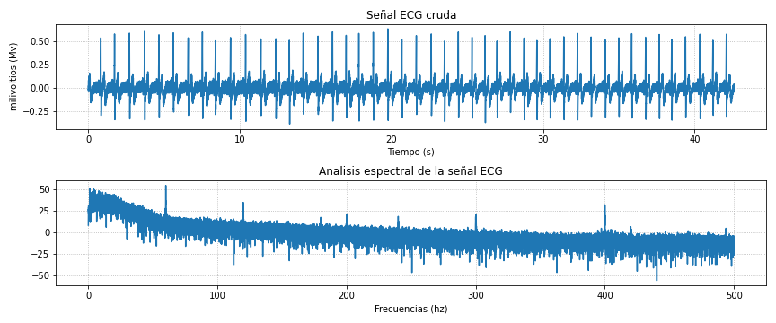
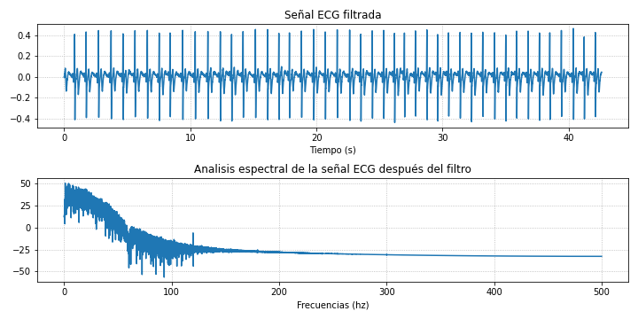
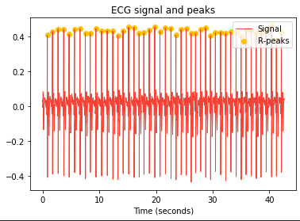
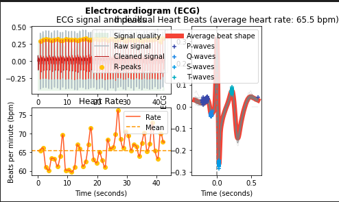
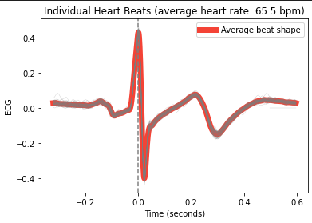

# Procesamiento de ECG

## Laboratorio - Equipo 6

## Tabla de contenido

- Introducción
- Materiales
- Métodos
- Resultados: Gráficas e imágenes   
- Discusión
- Referencias

## Introducción

El Electrocardiograma (ECG) es una herramienta fundamental en la práctica médica, que ha revolucionado la comprensión y diagnóstico de enfermedades cardíacas desde su invención a principios del siglo XX. Esta técnica no invasiva permite registrar la actividad eléctrica del corazón y proporciona información valiosa sobre su función, ritmo y salud en general.El corazón es un órgano muscular que se contrae rítmicamente para bombear sangre a todo el cuerpo. Esta actividad está regulada por un sistema eléctrico intrínseco. El ECG detecta estas señales eléctricas y las representa gráficamente en un electrocardiograma. Las principales ondas del ECG incluyen la onda P (representando la despolarización de las aurículas), el complejo QRS (marcando la despolarización de los ventrículos) y la onda T (indicando la repolarización ventricular) [1].

El ECG es una herramienta esencial para el diagnóstico de trastornos cardíacos. Puede identificar arritmias, como la fibrilación auricular o ventricular, así como el infarto de miocardio, insuficiencia cardíaca, y otros problemas cardíacos [2]. 

En la medicina moderna, el ECG se utiliza para una amplia gama de propósitos. Además de su papel en el diagnóstico, es fundamental en la evaluación preoperatoria, seguimiento de pacientes con enfermedades cardíacas, control de tratamientos y monitoreo a largo plazo [3]. Los avances tecnológicos han permitido la miniaturización de los dispositivos, lo que ha llevado a la creación de dispositivos portátiles, como los monitores Holter, que permiten un seguimiento continuo.

Asimismo, en el presente informe tuvo como objetivo la extracción de características de las señales de ECG, lo cual es fundamental por las razones como:

1. Diagnóstico médico: Para el monitoreo de enfermedades cardiovasculares, como arritmias, infartos de miocardio y trastornos de la conducción. La extracción de características permite a los médicos identificar patrones anormales en la señal, lo que facilita el diagnóstico preciso y el tratamiento oportuno [4].

2. Monitorización continua: En entornos de cuidados intensivos y unidades de monitoreo, se utiliza la extracción de características para rastrear la actividad eléctrica del corazón de los pacientes de forma continua. Esto permite una supervisión constante y una respuesta rápida en caso de emergencia [5].

3. Reducción de ruido: Las características extraídas también pueden utilizarse para eliminar ruido o artefactos de las señales de ECG, mejorando la calidad de los datos y facilitando el análisis posterior [6].

4. Automatización: La extracción automática de características es fundamental para la automatización de procesos, lo que agiliza el análisis de grandes volúmenes de datos de ECG y reduce la carga de trabajo de los profesionales de la salud [7].

## metodología 

La presente metodología de análisis de señales de ECG permite procesar y caracterizar eficazmente las señales cardíacas, mejorando la capacidad de detección de patrones y contribuyendo a la toma de decisiones clínicas.

## Resultados

## Discusiones

## Referencias

1. Lectura del DataSet:
   - Se inició el proceso leyendo el conjunto de datos que contenía las señales de ECG que habían sido obtenidas anteriormente.

2. Análisis en frecuencia:
   - Se realizó un análisis de la señal ECG en el dominio de frecuencia para detectar componentes de ruido a 50 Hz y 150 Hz.

3. Filtro pasabanda:
   - La señal se filtró con un paso banda para resaltar las componentes de interés en el rango de frecuencias deseado.

4. Filtro paso alto:
   - Se aplicó un filtro paso alto para eliminar componentes de frecuencia no deseadas y realzar las variaciones rápidas en la señal.

5. Filtrado derivativo:
   - Se realizó un filtrado derivativo para acentuar las transiciones de la señal y resaltar las pendientes.

6. Elevación al cuadrado:
   - La señal fue elevada al cuadrado para enfatizar las áreas con mayor cambio y destacar las ondas QRS.

7. Operador moving window integration:
   - Se aplicó el operador Moving Window Integration para suavizar la señal y reducir el ruido.

8. Marcado de picos:
   - Se identificaron y marcaron los picos en la señal, destacando los puntos de mayor amplitud que correspondían a los complejos QRS.

9. Análisis de threshold:
    - Se aproximó el umbral de referencia para identificar los picos R y ruidos en la señal ECG.

10. Obtención de complejos QRS:
    - Finalmente, se determinaron y obtuvieron los complejos QRS en la señal ECG, proporcionando información relevante para el diagnóstico clínico y la evaluación de la actividad cardíaca.

## Resultados

 Figura 1: Señal ECG sin preprocesamiento y FFT de la misma

 
SNR de la señal sin preprocesamiento: 19

 Figura 2: Señal ECG filtrada y FFT de la misma

 
 SNR en decibeles de la señal filtrada: 30

 Figura 3: Onda R ECG

 

 Figura 4: ECG informacion

 

 Figura 5: EC forma promedio

 

{'MaxRR': 1.005023592103102, 'MinRR': 0.7880184980868101, 'AvgRR': 0.9171326400463234, 'MaxBPM': 76.14034460570525, 'MinBPM': 59.70009109382657, 'AvgBPM': 65.42128954975308, 'SDNN': 0.05148593004404226, 'SD1': 0.040181639816521106, 'SD2': 0.06072098324842404, 'SD1/SD2': 0.6617422457098302, 'NN20': 35, 'pNN20': 79, 'NN50': 19, 'pNN50': 43, 'ULF_Power': 0.0, 'VLF_Power': 0.0, 'LF_Power': 0.00064, 'HF_Power': 0.00115, 'LF_HF_Ratio': 0.5565217391304348, 'Total_Power': 0.00179}

## Discusiones

## Referencias
[1] What is an electrocardiogram (ECG)? [Internet]. Nih.gov. Institute for Quality and Efficiency in Health Care (IQWiG); 2019 [cited 2023 Oct 30]. Available from: https://www.ncbi.nlm.nih.gov/books/NBK536878/
‌[2] Samol A, Bischof K, Blerim Luani, Pascut D, Wiemer M, Sven Kaese. Single-Lead ECG Recordings Including Einthoven and Wilson Leads by a Smartwatch: A New Era of Patient Directed Early ECG Differential Diagnosis of Cardiac Diseases? Sensors [Internet]. 2019 Oct 10 [cited 2023 Oct 30];19(20):4377–7. Available from: https://www.mdpi.com/1424-8220/19/20/4377
[3] Flores N, Reyna MA, Avitia RL, José Antonio Cárdenas-Haro, Conrado García. Non-Invasive Systems and Methods Patents Review Based on Electrocardiogram for Diagnosis of Cardiovascular Diseases. Algorithms [Internet]. 2022 Feb 28 [cited 2023 Oct 30];15(3):82–2. Available from: https://www.mdpi.com/1999-4893/15/3/82
‌[4] Anuoluwapo Ajibade, Younas H, Pullan M, Amer Harky. Telemedicine in cardiovascular surgery during COVID‐19 pandemic: A systematic review and our experience. Journal of Cardiac Surgery [Internet]. 2020 Aug 16 [cited 2023 Oct 30];35(10):2773–84. Available from: https://onlinelibrary.wiley.com/doi/full/10.1111/jocs.14933
[5] Pezawas T. ECG Smart Monitoring versus Implantable Loop Recorders for Atrial Fibrillation Detection after Cryptogenic Stroke—An Overview for Decision Making. Journal of Cardiovascular Development and Disease [Internet]. 2023 Jul 18 [cited 2023 Oct 30];10(7):306–6. Available from: https://www.mdpi.com/2308-3425/10/7/306
[6] Chiang HT, Hsieh YY, Fu SW, Hung KH, Tsao Y, Chien SY. Noise Reduction in ECG Signals Using Fully Convolutional Denoising Autoencoders. IEEE Access [Internet]. 2019 Jan 1 [cited 2023 Oct 30];7:60806–13. Available from: https://ieeexplore.ieee.org/abstract/document/8693790
‌[7] An JM, Gregg RE, Soheil Borhani. Effective Data Augmentation, Filters, and Automation Techniques for Automatic 12-Lead ECG Classification Using Deep Residual Neural Networks. 2022 44th Annual International Conference of the IEEE Engineering in Medicine & Biology Society (EMBC) [Internet]. 2022 Jul 11 [cited 2023 Oct 30]; Available from: https://ieeexplore.ieee.org/abstract/document/9871654

