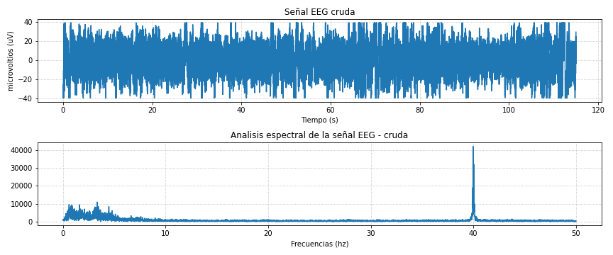
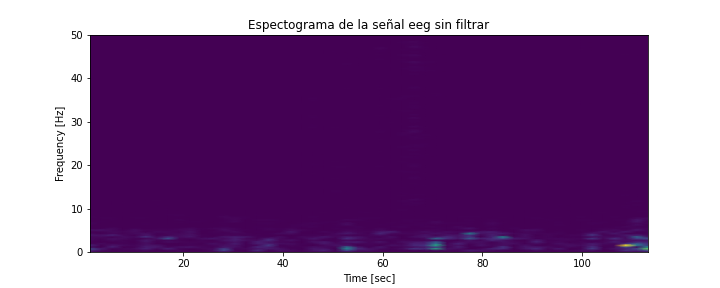
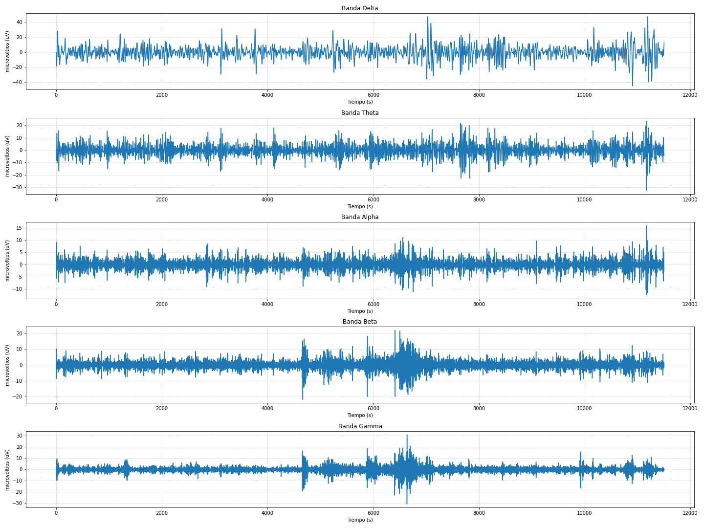
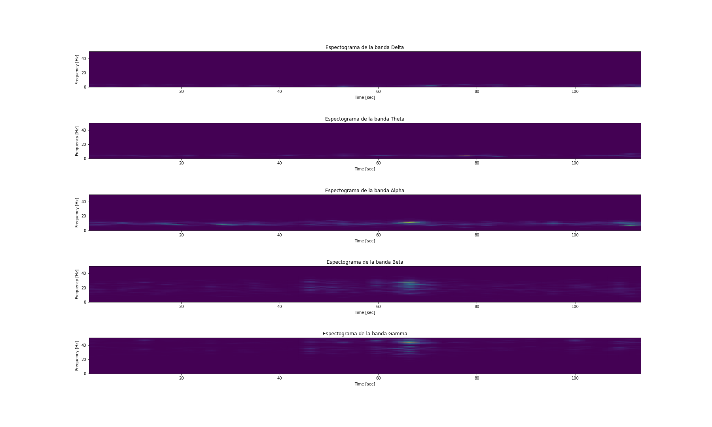
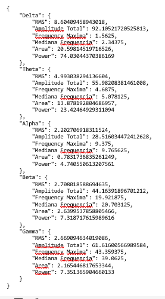

# Procesamiento de EEG

## Laboratorio 9 - Equipo 6

## Tabla de contenido

- Introducción
- Materiales
- Métodos
- Resultados: Gráficas e imágenes   
- Discusión
- Referencias

## Introducción

El electroencefalograma (EEG) es un registro de la señal eléctrica generada por la acción cooperativa de las células cerebrales, o más precisamente, el curso temporal de los potenciales de campo extracelular generados por su acción sincrónica. La variación de potencial eléctrico capturada por estos electrodos proporciona información sobre la actividad neuronal y los patrones de ondas cerebrales. Las señales se obtienen a través de electrodos, estos se colocan electrodos en la superficie del cuero cabelludo. Los electrodos registran la actividad eléctrica generada por las neuronas en forma de señales eléctricas. Estas señales se mide en microvoltios.

Las señales EEG muestran distintas frecuencias de ondas cerebrales, clasificadas en:
Delta (0.5-4 Hz): Predominantes durante el sueño profundo.
Theta (4-8 Hz): Presentes en sueño ligero y en estados de relajación.
Alpha (8-13 Hz): Relacionadas con estados de relajación y actividad cerebral disminuida.
Beta (13-30 Hz): Asociadas con actividad cerebral activa y estados de alerta.
Gamma (30-100 Hz): Relacionadas con procesos cognitivos superiores.

La contribución de los diferentes ritmos al EEG depende de la edad y del estado de comportamiento del sujeto, principalmente del nivel de alerta. También existen considerables diferencias entre sujetos en las características del EEG. El patrón de EEG está influenciado por condiciones neuropatológicas, trastornos metabólicos y la acción de los fármacos. 
 
En el contexto del procesamiento de señales EEG, es posible emplear filtros con el fin de suprimir artefactos no deseados, como la actividad muscular o interferencias eléctricas. Asimismo, se pueden fragmentar las señales en segmentos con el propósito de simplificar el análisis, especialmente en investigaciones que se centran en eventos particulares. Además, se lleva a cabo un análisis de la frecuencia para evaluar la contribución relativa de cada banda de frecuencia en la señal, todo ello adaptado a los objetivos específicos de los estudios que se estén llevando a cabo.

Las señales EEG (electroencefalográficas) son de gran importancia en el ámbito biomédico por varias razones, ya que proporcionan información única sobre la actividad eléctrica del cerebro.

Investigación Científica:
Las señales EEG son esenciales para la investigación en neurociencia y biomedicina. Proporcionan datos sobre la función cerebral que son fundamentales para comprender cómo el cerebro procesa información, regula funciones corporales y se ve afectado por diversas condiciones médicas.

Desarrollo de Dispositivos Médicos:
Las señales EEG son utilizadas en el desarrollo de dispositivos médicos, como interfaces cerebro-máquina y neuroprótesis. Estos dispositivos aprovechan la capacidad del cerebro para generar señales eléctricas, permitiendo a las personas controlar prótesis u otros dispositivos mediante la actividad cerebral.

Diagnóstico y Evaluación de Tratamientos: En el ámbito biomédico, el EEG es fundamental para el diagnóstico de trastornos neurológicos y psiquiátricos. También se utiliza para evaluar la eficacia de tratamientos, como terapias farmacológicas o intervenciones no farmacológicas.

Monitoreo de Estados de Conciencia: Las señales EEG son cruciales para monitorear estados de conciencia, tanto en el contexto clínico como en la investigación. Pueden proporcionar información sobre la vigilia, el sueño, y cambios en la conciencia que son relevantes en unidades de cuidados intensivos y otros entornos médicos.

Estudios de Sueño y Ritmos Circadianos:En la investigación biomédica del sueño, el EEG se utiliza para estudiar patrones de sueño y ritmos circadianos. Ayuda a comprender los mecanismos subyacentes de los trastornos del sueño y a desarrollar estrategias de tratamiento.

Evaluación de la Respuesta a Estímulos: Las señales EEG son utilizadas para evaluar cómo el cerebro responde a diferentes estímulos, lo que es relevante para estudios de percepción sensorial, procesamiento cognitivo y atención.

Estudios de Desarrollo Cognitivo:En la investigación biomédica relacionada con el desarrollo cognitivo, el EEG se utiliza para estudiar cómo evolucionan los patrones de actividad cerebral en niños y adultos jóvenes, proporcionando información sobre el desarrollo del cerebro.

En el presente informe, se está utilizando los filtros IIR, el cual es un tipo de filtro utilizado en procesamiento de señales que tienen la característica de tener una respuesta infinita en el tiempo en respuesta a una entrada impulsiva, además separar las señales por bandas de frecuencia. Estas características proporcionan una visión detallada y útil de la información contenida en la señal para la toma de decisiones [1]. 

## Metodología

1. Pre acondicionamiento de datos EEG
- Se empleó un dataset de señales cerebrales adquiridas en un laboratorio anterior.
2. Filtrado con Filtros IIR pasabandas

- Filtro Delta: Se aplicó un filtro IIR pasabandas con frecuencia de corte entre 1 y 4 Hz.
- Filtro Theta: Se aplicó un filtro IIR pasabandas con frecuencia de corte entre 4 y 8 Hz.
- Filtro Alpha: Se aplicó un filtro IIR pasabandas con frecuencia de corte entre 8 y 13 Hz.
- Filtro Beta: Se aplicó un filtro IIR pasabandas con frecuencia de corte entre 13 y 30 Hz.
- Filtro Gamma: Se aplicó un filtro IIR pasabandas con frecuencia de corte entre 30 y 80 Hz.
3. Filtro Notch
- Se aplicó un filtro notch para eliminar la frecuencia de 40 Hz y sus armónicos.
4. Extracción de Características
- Utilizar métodos específicos para la extracción de características en todas las bandas anteriormente mencionadas, como el poder total de señal, RMS, la amplitud media, la potencia en bandas de frecuencia y el área. 

## Resultados

 Figura 1: Señal curda y Respuesta en frecuencia de la señal cruda 

 

 Figura 2: Espectograma de la señal cruda

 

 Figura 3: Señal separada por bandas delta, theta, alpha, beta y gamma.

 

 Figura 4: Espectograma separado por señales

 

 Figura 5: Características de bandas

 

## Discusión

- Se aprecia que las señales EEG obtenidas presentan la característica de ser dinámicas, ya que muestran  variaciones dependiendo de la actividad del cerebro. Además, estas no presentan un patrón que se reproduzca constantemente y están expuestas a muchos ruidos y artefactos [2].

- Primero se obtiene la señal EEG cruda en función del tiempo y su análisis de respuesta en frecuencia. La señal está denotada por la línea azul y se aprecia un pico alrededor de los 40 Hz en el análisis de respuesta en frecuencia, la cual puede deberse a artefactos o ruido. Posteriormente, se filtró y se separó por bandas de acuerdo a diferentes frecuencias de las ondas cerebrales.
El filtrado sirve para eliminar el ruido y mejorar la calidad de la señal ayudando a la extracción de características.

- Las ondas gamma y beta presentaron mayor amplitud. Esto es debido a que durante el estudio se realizaron distintas preguntas simples y complejas, por lo que estas ondas están implicadas en actividades cerebrales y momentos de extrema atención, respectivamente [2].

- Las ondas alfa se presentan mejor cuando el individuo se encuentra en un estado relajado, reposo y con los ojos cerrados. Estas pueden atenuarse cuando el individuo presenta un estado de contracción, por ejemplo al responder preguntas de cierta complejidad. Su amplitud va entre los 20-60 uv y esta disminuye con la edad. En los resultados observamos que el individuo presentó una amplitud máxima de 16 uv [3].

- Las ondas theta están relacionadas al aprendizaje, memoria e intuición mientras que las ondas delta están presentes en estado de sueño profundo y son las que mayor amplitud presenta de todas las ondas EEG. Cabe resaltar que las ondas EEG pueden ser alteradas por artefactos de origen muscular, ruido electromagnético o la actividad del corazón [4].

- De los resultados obtenidos vemos que las señales con mayor amplitud fueron la delta, gamma y beta. Las cuales las dos últimas presentaron mayor activación debido al tipo experimento.

## Referencias

[1] K. Blinowska and P. Durka, “ELECTROENCEPHALOGRAPHY (EEG).” Available: https://citeseerx.ist.psu.edu/document?repid=rep1&type=pdf&doi=d0e3a5e418f4ba8ff3ba117d45f9cc6b1d89ee7d

[2] “Ondas Cerebrales ▷ Tipos de Ondas, Desequilibrios y Tratamientos,” Neuroscenter, Jan. 31, 2023. https://neuroscenter.com/neurofeedback/ondas-cerebrales/#:~:text=Realizando%20un%20EEG%20se%20puede,nuestros%20pensamientos%2C%20conductas%20y%20emociones. (accessed Nov. 12, 2023).

‌[3] N. Tips, “EEG NORMAL Y VARIANTES,” YouTube. Nov. 11, 2020. Accessed: Nov. 12, 2023. [YouTube Video]. Available: https://www.youtube.com/watch?v=zneziY42oQE&ab_channel=NeuroTips

[4] Pérez Alberruche, Beatriz, “Procesamiento de señales de electroencefalograma mediante wavelets para la eliminación de artefactos cardíacos - Archivo Digital UPM,” Oa.upm.es, Sep. 2022, doi: https://oa.upm.es/71888/.