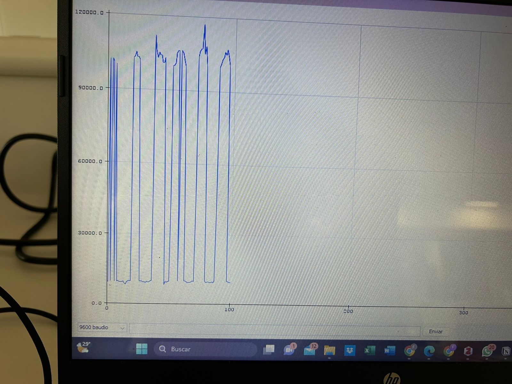
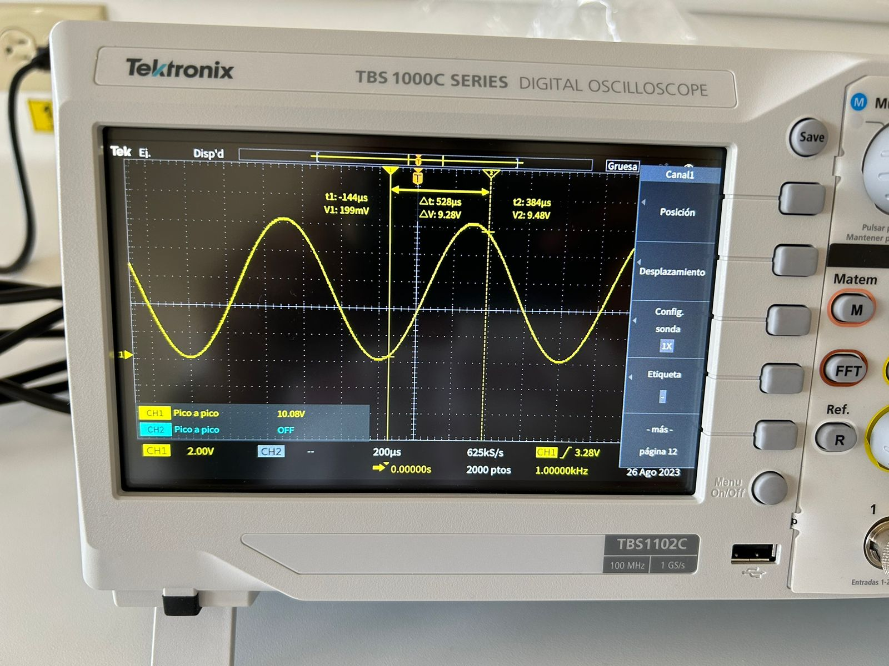
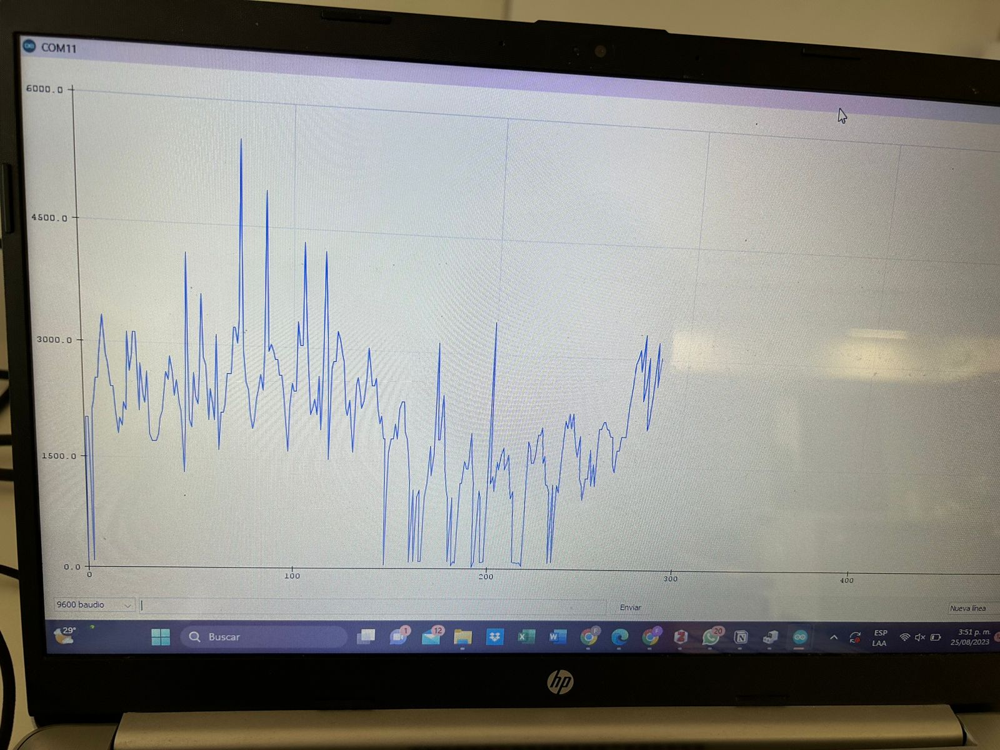
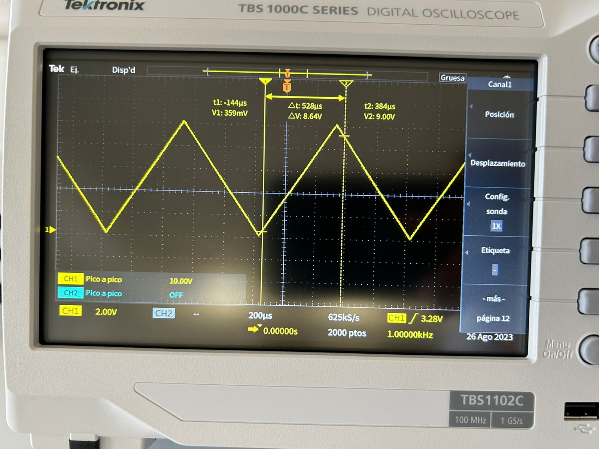
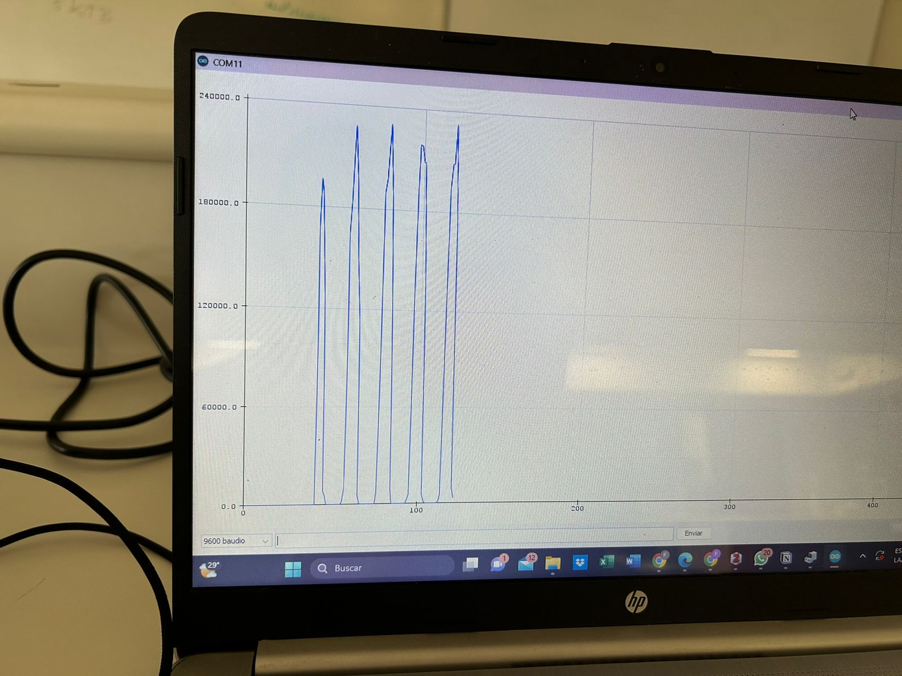

## Diferencias entre la señal del osciloscopio y el arduino

Las diversas fuentes de interferencias electromagnéticas presentes en el laboratorio pueden ser responsables de la degradación de la señal obtenida desde el Arduino. Algunas de las fuentes posibles de EMI y cómo afectan la señal pueden ser las siguientes [1]:

1. Tomacorrientes y Cables de Alimentación: Los tomacorrientes y los cables de alimentación pueden generar campos electromagnéticos debido al flujo de corriente a través de ellos. Si estos cables pasan cerca de los cables o componentes del Arduino, podrían acoplar ruido en la señal.

2. Otras Computadoras y Dispositivos Electrónicos: Las computadoras, celulares, proyectores y otros dispositivos electrónicos también generan campos electromagnéticos, especialmente cuando están en funcionamiento. Estos campos pueden acoplarse en los cables y componentes del Arduino, introduciendo ruido en la señal.

3. Aire Acondicionado y Equipos de Refrigeración: Los equipos de refrigeración y aire acondicionado pueden generar ruido eléctrico y campos electromagnéticos debido a los motores y componentes eléctricos en su interior.

4. Leds y Luces Fluorescentes: Las luces LED y fluorescentes también pueden generar ruido electromagnético debido a la modulación de la corriente que alimenta las lámparas.

5. Cables de Alimentación y de Señal: Si los cables de alimentación y de señal del Arduino no están correctamente apantallados, pueden actuar como antenas y captar interferencias electromagnéticas del entorno.

6. Para leer una señal analógica, el Arduino utiliza un conversor analógico-digital (ADC) que tiene una frecuencia de muestreo máxima de unos 10 kHz. Esto significa que el Arduino puede tomar 10.000 muestras por segundo de una señal analógica.
Un osciloscopio puede tener una frecuencia de muestreo mucho mayor que un Arduino, dependiendo del modelo y la configuración. Por ejemplo, un osciloscopio digital puede tener una frecuencia de muestreo de hasta varios GHz2, lo que significa que puede tomar miles de millones de muestras por segundo de una señal analógica.
Por lo tanto, si se toma una imagen de una señal analógica con un Arduino y otra con un osciloscopio, se pueden distinguir por la frecuencia de muestreo. La imagen del Arduino tendrá menos puntos y más espacios entre ellos, lo que implica una menor resolución y precisión, la imagen capturada por el Arduino podría parecer distorsionada o incluso incorrecta debido a la incapacidad de capturar con precisión la forma de onda de alta frecuencia. La imagen del osciloscopio tendrá más puntos y menos espacios entre ellos, lo que implica una mayor resolución y precisión.

## Señal cuadrada

## Señal sinusoidad

## Señal Rampa

## Referencias

[1]
A. A. DiBiase, “EMC Europe 2023,” Interference Technology, May 05, 2011. https://interferencetechnology.com/electromagnetic-interference-sources-and-their-most-significant-effects/ (accessed Aug. 28, 2023).
