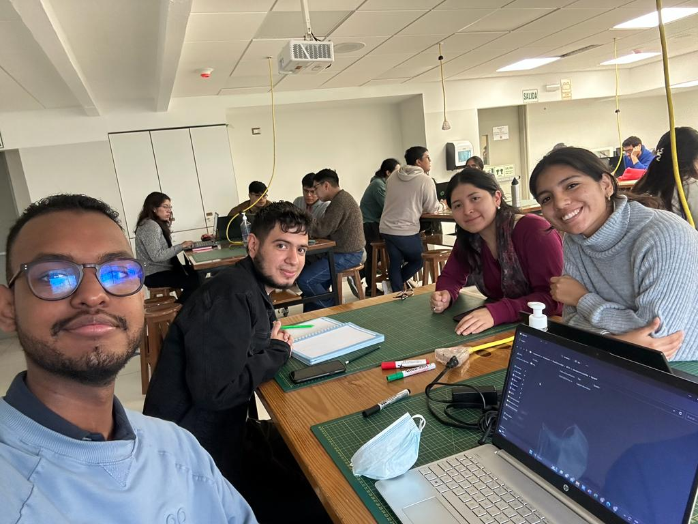

# Introducción de señales

Bienvenidos al repositorio del grupo 6.

Proyecto: Analizando señales de EMG  

## Integrantes 

- Lucero Gómez - 70669873
- Angie Nuñez - 73202687
- Victor Rivas - 71474515: Estudiante de ingeniería biomédica de décimo ciclo que quiere especializarse en ingeniería clínica y ingeniería de tejidos.
- Francisco Ruiz - AY853936: Estudiante de ingeniería biomédica interesado en la ciencia de datos, procesamiento de imagenes y programación backend.

## Tabla de contenidos

- [Introducción ](Documentacion/Index)
- Objetivos
- Materiales
- Metodología 
- Docentes 

